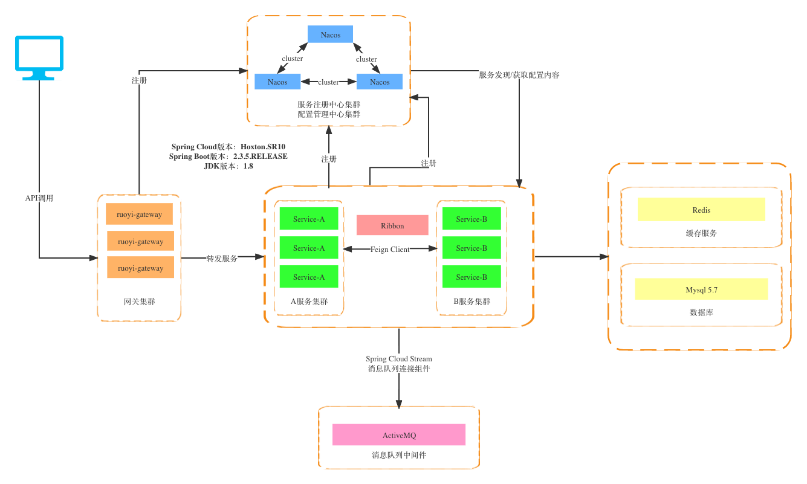
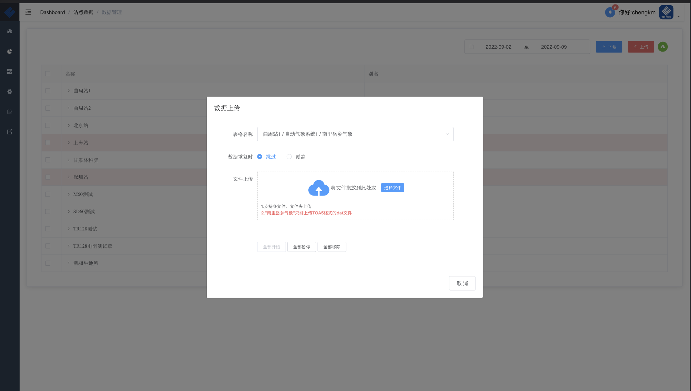

# 快速了解

## 它是什么?

华益瑞数据云平台(Truwel Cloud)是完全由华益瑞自主研发的一套**完整的**、**通用的**B/S架构数据管理平台，能够让广大科研用户快速便捷地管理台站的**数据**、**照片**、**监控**等各种类型业务数据。

平台目前用户有中国林业科学研究院、中国科学院新疆生态与地理研究所、中国科学院青藏高原研究所、中国生态系统研究网络(CERN)等。

## 主要特性

- 可部署在用户`Windows`/`Linux`服务器
- 后端支持`单体版`或`微服务版`
- 前端页面响应式布局
- 接口符合`RESTful API`规范
- 支持按钮级别数据权限
- 保证用户之间绝对的权限隔离
- 支持`微信`、`QQ`、`钉钉`、`短信`、`邮件`等多种方式的告警信息推送
- 支持数据报表一键导出
- 支持`MQTT`消息接入
- 支持国内外数采数据接入
- 支持物候照片及数据文件管理
- 支持符合国标GB28181监控视频接入
- 支持LAS点云数据接入

## 技术选型
1、系统环境
- Java EE 8
- Apache Maven 3
- Node 16
- NPM 8

2、主框架

`单体版`

- Spring Boot
- Spring Security

> 视频监控架构图:point_down:

视频监控`信令服务`与`流媒体服务`均采用成熟`开源`框架搭建,更加注重用户监控数据安全

`微服务版`

- Spring Cloud Hoxton
- Spring Framework

> 微服务版架构图:point_down:

3、持久层
- Apache MyBatis
- Alibaba Druid

4、消息中间件
- ActiveMQ
- Kafka

5、视图层
- Vue全家桶
- Element UI

6、数据库
- Mysql
- Redis

## 系统需求

- JDK >= 1.8
- MySQL >= 5.7
- Redis >= 7.0.0
- Windows Server or Linux
- 2核(vCPU) 8GiB内存 30GiB硬盘 5Mbps带宽

## 浏览器支持

支持现代浏览器, 不支持 IE

|  IE |  Edge |  Firefox |  Chrome |  Safari |
| :--------------------------------------------------------------------------------------------------------------------------------------------------------------------------------------------------: | :----------------------------------------------------------------------------------------------------------------------------------------------------------------------------------------------------: | :---------------------------------------------------------------------------------------------------------------------------------------------------------------------------------------------------------------: | :-----------------------------------------------------------------------------------------------------------------------------------------------------------------------------------------------------------: | :-----------------------------------------------------------------------------------------------------------------------------------------------------------------------------------------------------------: |
|                                                                                             not support                                                                                              |                                                                                            last 2 versions                                                                                             |                                                                                                  last 2 versions                                                                                                  |                                                                                                last 2 versions                                                                                                |                                                                                                last 2 versions                                                                                                |

# 使用手册

## 注册

> :raising_hand: 如果想体验平台功能可在首页进行注册，申请通过后会通过邮件通知

## 首页

:bar_chart: 系统页面分为三大部分，菜单栏用于切换不同功能，导航栏用于展示用户信息、报警信息以及路由信息，主区域展示各种数据信息；首页大屏可根据用户需求定制不同样式

> :100: 支持皮肤切换、展示数据自定义、分组全屏功能、左侧或顶部菜单栏切换
## 站点数据

### 气象数据

> **提示：** 可以拖拽中间区域:point_left:调整左右显示比例

#### 数据图表

默认显示第1个表格前两个字段的最近24小时数据，可通过设置按钮进行参数和间隔时间的选择，通过点击左边树形列表进行站点切换显示

> **提示：** 树形列表可按照系统类型进行划分展示;支持参数中:cn:英:us:显示、单位显示

#### 最新数据

展示表格最新一条数据，同样可以通过点击左边树形列表进行站点切换显示

#### 数据分析

在这里可以对数据进行更细化的分析，包括`折线图`、`散点图`、`风玫瑰`、`梯度图`、`列表`，可以对数据进行列表下载或打包下载

> **提示：** 参数可以随意组合，支持跨站点数据分析

### 物候数据

平台按照物候图片的类型进行分类展示，后期将增加GCC实时计算功能

> :camera: 目前支持`CCFC`、`NetCam`、`PhotoNet`等市面主流物候相机

### 点云数据

> :cloud: 目前仅支持`LAS`格式点云

### 视频监控

> **提示：** 可一、四、九分屏展示

### 原始文件

平台除了将对接数据直接入库外，不管原始文件是追加模式还是唯一模式都可以很方便地进行管理

### 数据管理

数据的:arrow_up:上传、:arrow_down:下载就在这里

> **提示：** 平台能够记住用户上次下载记录，方便之后进行一键下载:thumbsup:

### 数据报表

> **提示：** 可按周、月和季度定时生成:page_facing_up:

### 系统详情

全景图/视频、地图、档案资料等多种方式进行展示

## 系统监控

### 传输监控

对数据传输状态进行实时监控

> 1. 蓝色=>正常 
> 2. 红色=>离线

### 系统监控

对服务器CPU、Java虚拟机、磁盘状态进行实时监控

### 缓存监控

对Redis缓存进行实时监控

### 在线用户

对已登陆平台的用户进行管理，可以对其进行强退操作

## 系统管理

### 用户管理

> 一个用户可以分配多个角色

### 角色管理

### 菜单管理

可以对平台菜单栏内容进行更改，包括名称、顺序、图标等

### 视频管理

管理监控设备、视频通道、控制云台等

### 站点管理

平台按照`站点`->`系统`->`数据表`三级进行分类，在`数据表`层可继续细分`数据`、`图片`和`文件`三大类

> 平台目前支持`campbell数据`、`mqtt消息`、`本地文件`等多种市面主流数据类型，其他类型可根据需求进行定制开发

## 日志管理

### 数据告警

### 登陆日志

### 操作日志

> 操作日志颗粒度可根据用户需求增减